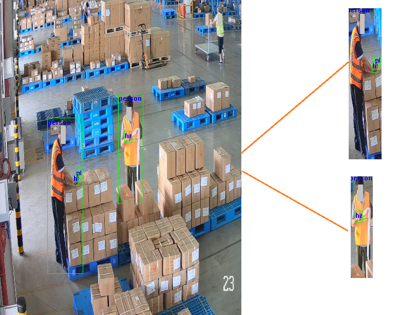

此工具对全图中的单个分类的图像数据进行解决，并将包含在该分类中的其他分类的标注进行转换，转化才能对应位置的标注，效果图如上


使用方法如下：

python CropAndCreateLabel.py 

如果需要修改目录和crop的分类，修改CropAndCreateLabel.py的以下内容
```
crop_class = 'person'#分类名称
src_label_dir = './phone'#要处理的目录
crop_and_create = CropAndCreate(src_label_dir, crop_class)
crop_and_create.start()
```